# 📘 Tugas Pertemuan 6 - Eksplorasi Database dengan Query

**Nama:** Nurul Afni Khasifa  
**NIM:** 60324037  
**Program Studi:** Informatika  
**Mata Kuliah:** Pemrograman Web II  

---

## 🔹 1. STATISTIK BUKU

### 1.1 Total Buku
**Deskripsi:** Menghitung jumlah keseluruhan data buku dalam tabel

```sql
SELECT COUNT(*) AS total_buku
FROM buku;
```

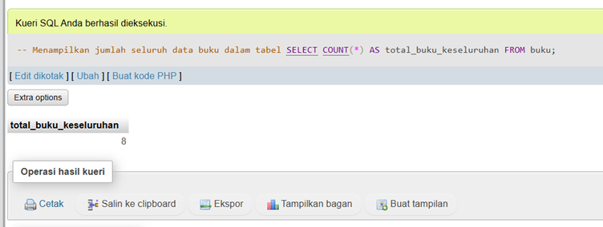

---

### 1.2 Total Nilai Inventaris
**Deskripsi:** Menghitung total nilai inventaris (harga × stok)

```sql
SELECT SUM(harga * stok) AS total_nilai
FROM buku;
```

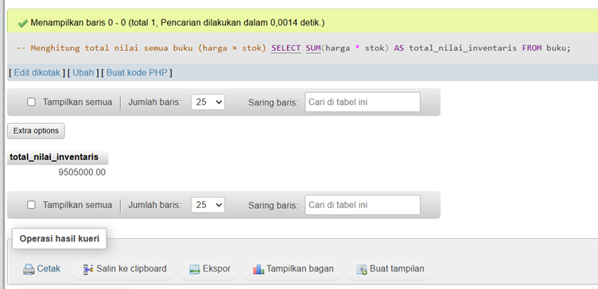

---

### 1.3 Rata-rata Harga Buku
**Deskripsi:** Menghitung nilai rata-rata harga semua buku

```sql
SELECT AVG(harga) AS rata_harga
FROM buku;
```

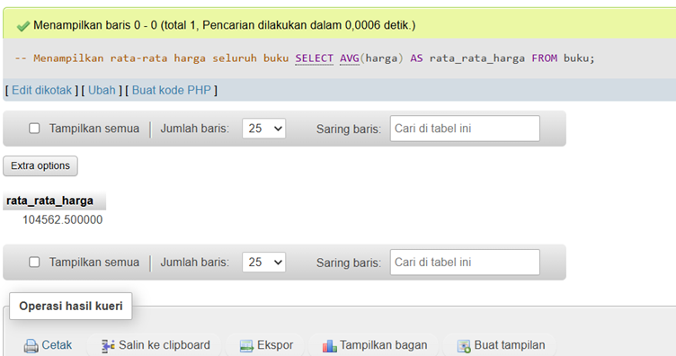

---

### 1.4 Buku Termahal
**Deskripsi:** Menampilkan buku dengan harga tertinggi

```sql
SELECT judul, harga
FROM buku
ORDER BY harga DESC
LIMIT 1;
```

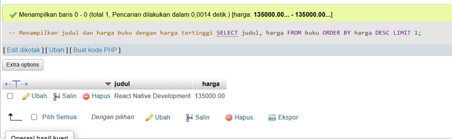

---

### 1.5 Stok Terbanyak
**Deskripsi:** Menampilkan buku dengan stok paling banyak

```sql
SELECT judul, stok
FROM buku
ORDER BY stok DESC
LIMIT 1;
```

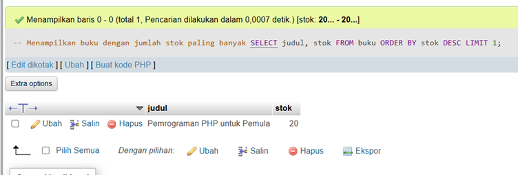

---

## 🔹 2. FILTER & PENCARIAN

### 2.1 Kategori Programming dengan Harga < 100.000
**Deskripsi:** Mencari buku kategori Programming dengan harga di bawah Rp 100.000

```sql
SELECT *
FROM buku
WHERE kategori = 'Programming'
AND harga < 100000;
```

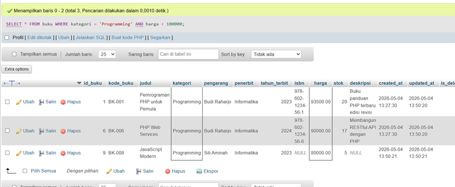

---

### 2.2 Buku dengan Judul Mengandung PHP atau MySQL
**Deskripsi:** Mencari buku yang judulnya mengandung kata PHP atau MySQL

```sql
SELECT *
FROM buku
WHERE judul LIKE '%PHP%'
OR judul LIKE '%MySQL%';
```

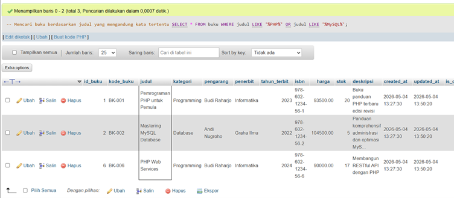

---

### 2.3 Buku Terbit Tahun 2024
**Deskripsi:** Menampilkan semua buku yang terbit pada tahun 2024

```sql
SELECT *
FROM buku
WHERE tahun_terbit = 2024;
```

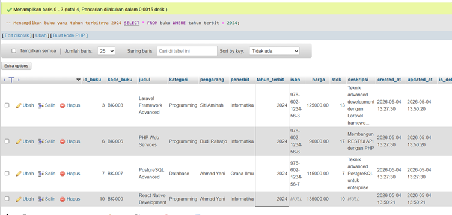

---

### 2.4 Buku dengan Stok Antara 5–10
**Deskripsi:** Mencari buku yang memiliki stok dalam rentang 5 hingga 10 unit

```sql
SELECT *
FROM buku
WHERE stok BETWEEN 5 AND 10;
```

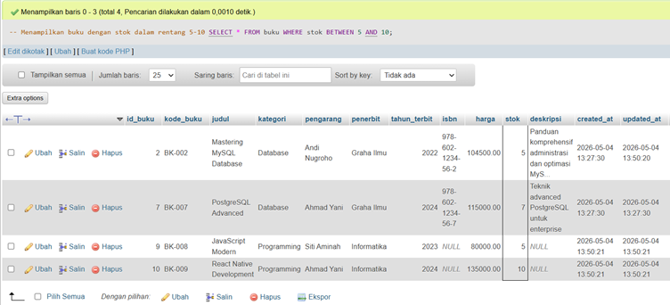

---

### 2.5 Buku Pengarang Budi Raharjo
**Deskripsi:** Mencari semua buku yang ditulis oleh Budi Raharjo

```sql
SELECT *
FROM buku
WHERE pengarang = 'Budi Raharjo';
```

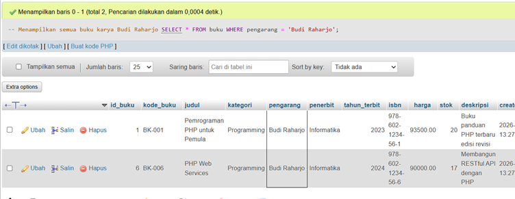

---

## 🔹 3. GROUPING & AGREGASI

### 3.1 Jumlah Buku dan Stok per Kategori
**Deskripsi:** Mengelompokkan data buku berdasarkan kategori dengan menghitung jumlah buku dan total stok

```sql
SELECT kategori, COUNT(*) AS jumlah, SUM(stok) AS total_stok
FROM buku
GROUP BY kategori;
```

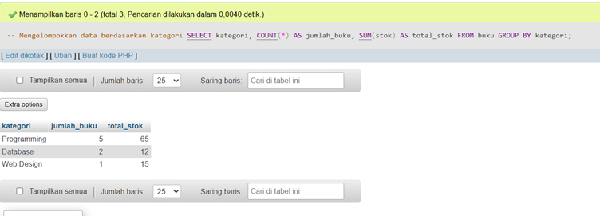

---

### 3.2 Rata-rata Harga per Kategori
**Deskripsi:** Menghitung rata-rata harga buku untuk setiap kategori

```sql
SELECT kategori, AVG(harga) AS rata_harga
FROM buku
GROUP BY kategori;
```

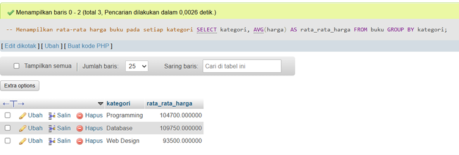

---

### 3.3 Nilai Inventaris Terbesar per Kategori
**Deskripsi:** Menemukan kategori dengan nilai inventaris (total harga × stok) terbesar

```sql
SELECT kategori, SUM(harga * stok) AS total_nilai
FROM buku
GROUP BY kategori
ORDER BY total_nilai DESC
LIMIT 1;
```

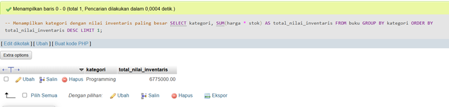

---

## 🔹 4. UPDATE DATA

### 4.1 Kenaikan Harga 5% untuk Kategori Programming
**Deskripsi:** Meningkatkan harga semua buku kategori Programming sebesar 5%

```sql
UPDATE buku
SET harga = ROUND(harga * 1.05, 0)
WHERE kategori = 'Programming';
```

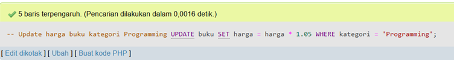
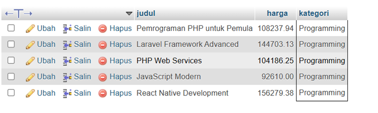

---

### 4.2 Tambah Stok 10 Unit untuk Buku dengan Stok < 5
**Deskripsi:** Menambah stok sebanyak 10 unit untuk buku yang stoknya kurang dari 5

```sql
UPDATE buku
SET stok = stok + 10
WHERE stok < 5;
```

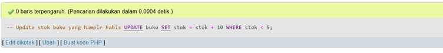
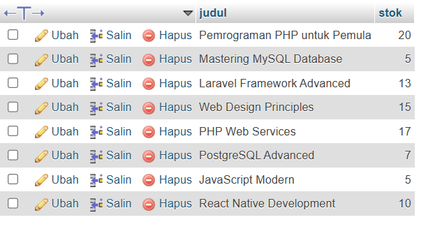

---

## 🔹 5. LAPORAN

### 5.1 Buku yang Perlu Restock (Stok < 5)
**Deskripsi:** Menampilkan daftar buku yang stoknya kurang dari 5 unit dan perlu untuk direstock

```sql
SELECT *
FROM buku
WHERE stok < 5;
```

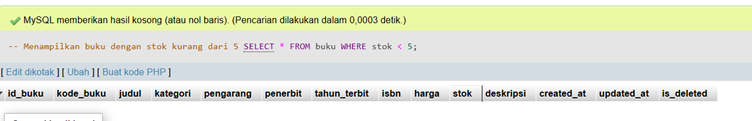

---

### 5.2 Top 5 Buku Termahal
**Deskripsi:** Menampilkan 5 buku dengan harga tertinggi beserta informasi stok

```sql
SELECT judul, harga, stok
FROM buku
ORDER BY harga DESC
LIMIT 5;
```

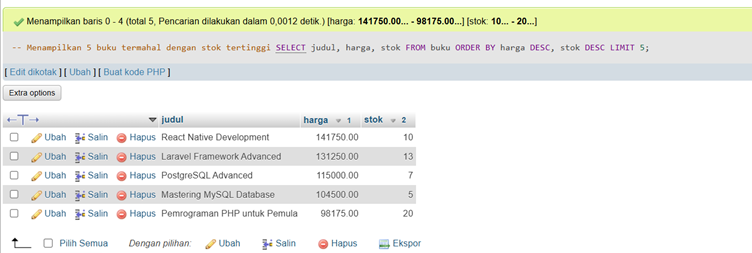

---

## 📊 Tugas 2 - DESAIN DATABASE

### Diagram Entity Relationship (ERD)


---

### Struktur Relasi Tabel


### Struktur Tabel Buku
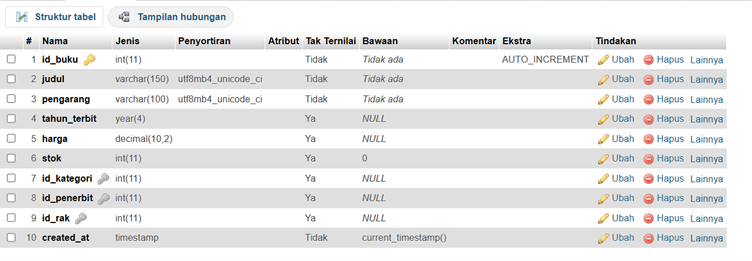

---

## 🔹 Data Tabel

### Kategori & Penerbit


### Data Buku


---

## 🔹 Query JOIN

### Buku + Kategori + Penerbit


### Jumlah per Kategori


### Jumlah per Penerbit


### Detail Lengkap


---

## 🔹 Fitur Tambahan

### Tabel Rak


### Soft Delete


### Stored Procedure


---